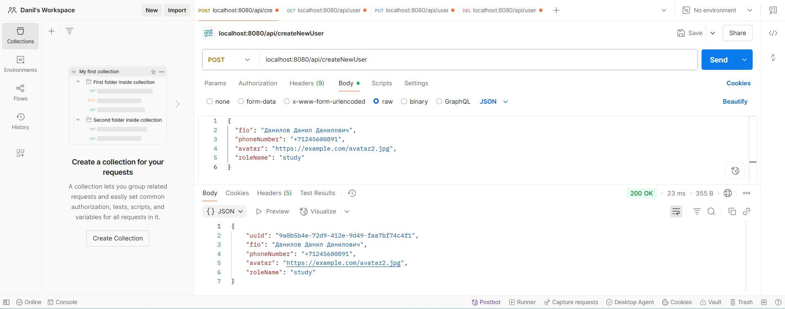
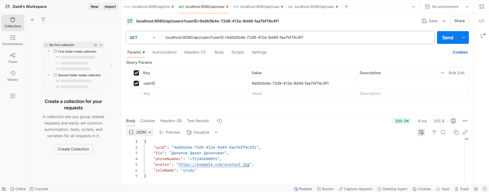
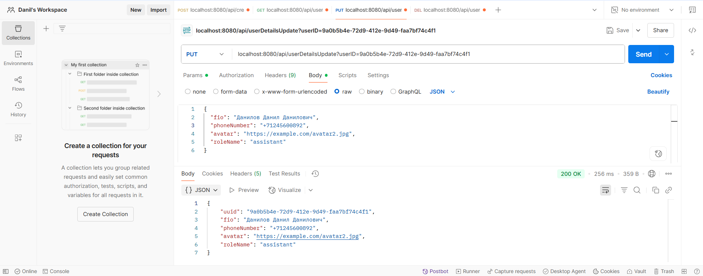
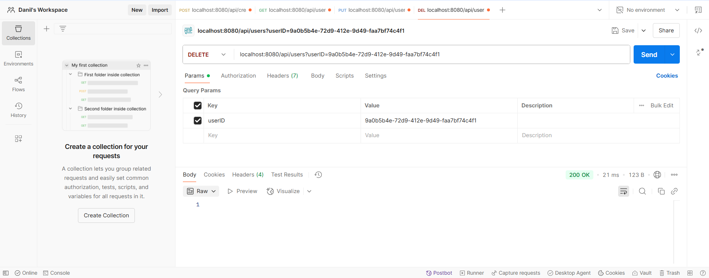

# User Management API

Простое REST API для управления пользователями с использованием Spring Boot и PostgreSQL.

## Технологии
- **Java 17**
- **Spring Boot**
- **Spring Data JPA**
- **PostgreSQL**
- **Lombok** (для сокращения boilerplate-кода)
- **Hibernate Validator** (для валидации данных)

### Требования
- **Java 17**
- **PostgreSQL**
- **Maven**

## Скриншоты

